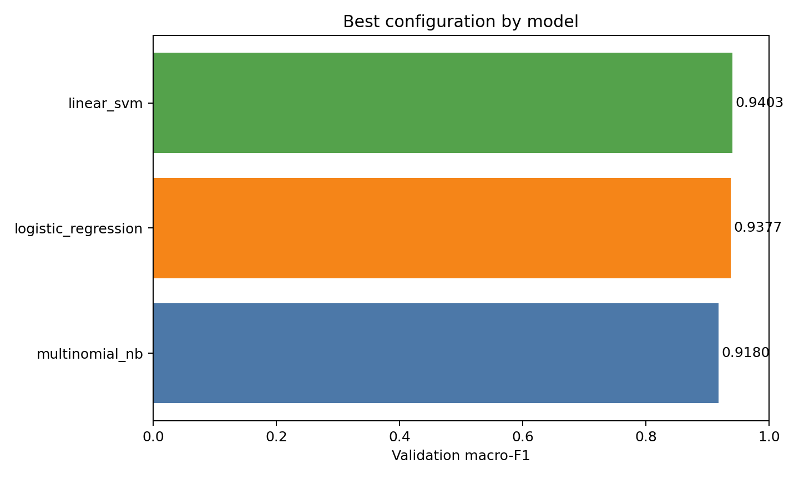
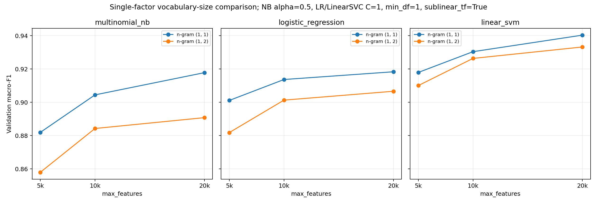
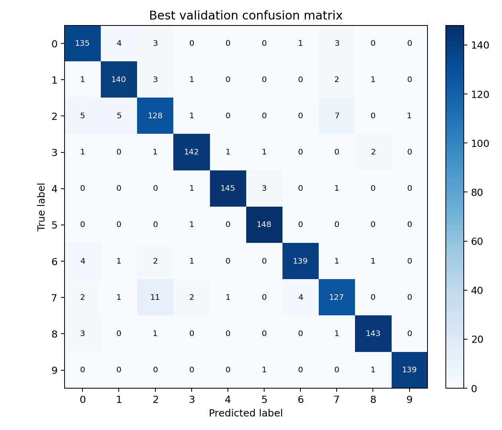
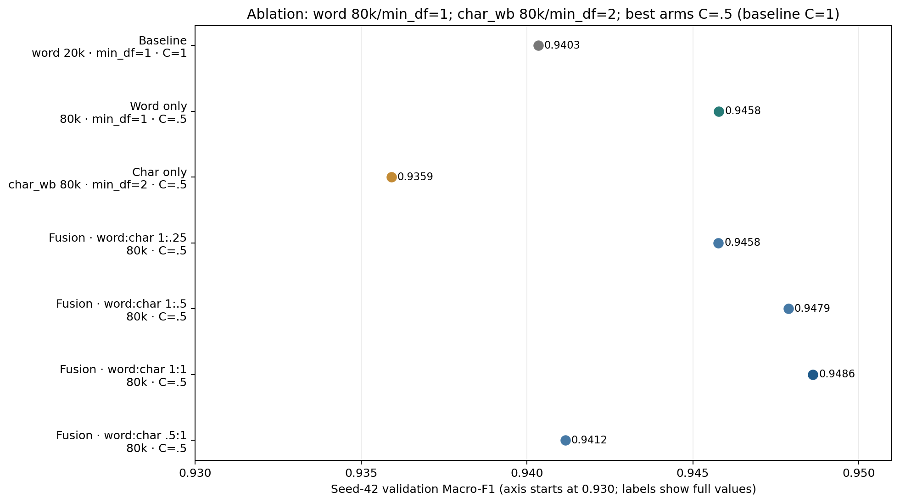
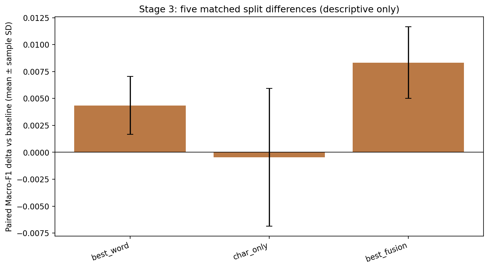
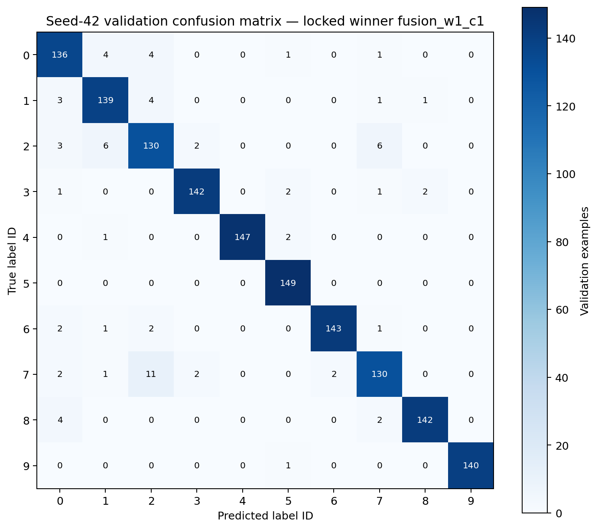

# Project 1：英文文本分类实验

姓名：________________　学号：________________

## 问题与初步想法

任务是根据英文文本预测整数标签 `0`–`9`。数据没有给出标签 ID 到官方类别名称的映射，所以我只把 ID 当作类别编号；下面的主题观察来自正文和 Subject，而不是给标签臆造名称。

开始时我的想法是：文本可能含有较明显的关键词，TF–IDF 加线性分类器应当是强而实用的基线；加入 bigram 或字符片段也许能补充短语、拼写和格式信息，但特征数和计算量会增加。因此第一轮比较词表大小、unigram/bigram 和三种分类器，用分层验证集 Macro-F1 选模型；第二轮再在锁定流程下单独试较大词表、字符特征及其融合。所有结论都以实际运行结果为准。

## 数据浏览与验证方法

训练集有 7,368 行，测试集有 2,457 行，训练标签覆盖十个整数类。检查到两份 CSV 均无缺失或空白文本，训练集没有精确重复行，训练/测试文本也没有精确重叠；十类数量约为 705–747。文本字符数中位数为 1,139，最长 160,616，分布有长尾。我没有删除、去重、截断或改写原始数据。浏览文本时，我能观察到科技、计算机设备、软件、通信等讨论，但这只是文本内容描述，不是标签定义。

两轮验证都先做固定随机种子的分层 80/20 划分，TF–IDF 只在训练折拟合，再变换验证折；第一轮 seed 42 的训练折为 5,894 条、验证折为 1,474 条。第一轮完整比较 `max_features ∈ {5k, 10k, 20k}`、`ngram_range ∈ {(1,1),(1,2)}`，再与 NB `alpha ∈ {0.1,0.5,1}`、LR `C ∈ {0.1,1,10}`、LinearSVC `C ∈ {0.1,1,10,100}` 组合，共 60 个候选。第二轮也以 seed 42 开展预先限定的搜索，并在读取测试文本前写入最终配置锁定记录。选择主指标为 Macro-F1，完全相同时按预设候选次序取先出现者。seed 42 验证分数参与了选模，不能当作独立测试表现。

## 表示和分类器原理

词频-逆文档频率（TF–IDF）把文档表示为稀疏向量。本实验设置了 `sublinear_tf=True`，非零词频项为 `1 + ln(count)`；平滑逆文档频率为 `ln((1+n)/(1+df)) + 1`，最后按默认 L2 范数归一化。第一轮中这一开关始终固定，没有检验它本身是否带来提升。

MultinomialNB 假设给定类别后各特征条件独立，并以 `alpha` 加性平滑；非负 TF–IDF 在实践中可供其使用，但 TF–IDF 权重不是原始整数词频。LogisticRegression 用交叉熵目标和 L2 正则化，本次为 `lbfgs`、`max_iter=2000`。LinearSVC 优化 L2 正则化的 squared-hinge 损失，使用 one-vs-rest 多类策略和 `max_iter=5000`。本实验实际运行的是 LinearSVC，而不是 `SVC(kernel="linear")`：两者都可形成线性决策边界，但 LinearSVC 的优化实现适合稀疏文本特征；SVC 使用 LIBSVM，多类默认 one-vs-one，不能把两者当成同一实现。

词袋不保留词序。Word2Vec 词向量取平均仍不保留词序；BERT 等上下文模型可利用位置与上下文，但本实验没有运行它们。MLP 也仅作理论讨论：增加隐藏层或神经元会改变模型容量；增加训练迭代次数不会扩大网络结构容量，只会增加训练时间、使优化更充分，并可能更贴合训练样本。本实验未训练 MLP，也没有据此作实测结论。

## 第一轮：模型基线

| 模型（按验证 Macro-F1 选择） | 最佳配置 | Accuracy | Macro-F1 |
|---|---|---:|---:|
| MultinomialNB | unigram，20k，`alpha=0.1` | 0.917232 | 0.917994 |
| LogisticRegression | unigram，20k，`C=10` | 0.937585 | 0.937701 |
| LinearSVC | unigram，20k，`C=1` | 0.940299 | 0.940341 |

60/60 个候选成功，无 warning。LinearSVC 是该轮最佳基线。第一轮最佳配置五个预设 seed 的 Macro-F1 均值为 0.942172、样本标准差 0.004929；这些划分会重叠，seed 42 也用于选模，所以这只是切分敏感性描述。

## 第二轮：受控词表搜索、字符特征与融合

第二轮不增加模型种类，只评估 LinearSVC。阶段一限定为 unigram，按顺序局部搜索而非全组合：先比较 `max_features={20k,40k,80k,None}`（`min_df=1,C=1`），在当步赢家词表上比较 `min_df={1,2,3}`（`C=1`），再固定赢家词表与 `min_df` 比较 `C={1,0.5,2}`。每一步只改变一个因素，重复候选复用，最多 8 个唯一拟合。因此此结果是该预设路径的局部最优，不是所有参数空间的全局最优。选出的词级配置是 80k、`min_df=1`、`C=0.5`，验证 Accuracy 0.945726、Macro-F1 0.945784。阶段二固定该配置与 C，字符支路为 `char_wb` 3–5 gram、最多 80k 特征、`min_df=2`；比较 word-only、char-only 和四组融合权重。每个支路先 L2 归一化，融合时按权重缩放后拼接，再对组合向量做 L2 归一化；单支路保留原矩阵，不重复归一化。

阶段一八个唯一配置在 seed 42 的 Macro-F1 如下；这展示了沿预设搜索路径观察到的分数，不代表未搜索参数的表现。

| word unigram 配置（max_features / min_df / C） | Macro-F1 |
|---|---:|
| 20k / 1 / 1 | 0.940341 |
| 40k / 1 / 1 | 0.942305 |
| 80k / 1 / 1 | 0.945625 |
| 不设上限 / 1 / 1 | 0.944995 |
| 80k / 2 / 1 | 0.943059 |
| 80k / 3 / 1 | 0.941009 |
| 80k / 1 / 0.5 | **0.945784** |
| 80k / 1 / 2 | 0.944335 |

| seed 42 表示配置 | Accuracy | Macro-F1 |
|---|---:|---:|
| 历史基线：word 20k，`C=1` | 0.940299 | 0.940341 |
| 最佳 word：80k，`min_df=1, C=0.5` | 0.945726 | 0.945784 |
| char-only：`char_wb` 3–5 gram，80k，`min_df=2, C=0.5` | 0.935550 | 0.935915 |
| 融合 word:char = 1:0.25，`C=0.5` | 0.945726 | 0.945772 |
| 融合 word:char = 1:0.5，`C=0.5` | 0.947761 | 0.947878 |
| 融合 word:char = 1:1，`C=0.5` | **0.948440** | **0.948619** |
| 融合 word:char = 0.5:1，`C=0.5` | 0.940977 | 0.941154 |

预先规则选中的 seed 42 最终配置为 1:1 融合；此配置在进入阶段三之前已锁定，阶段三没有重新调参或改选。相对历史基线，Macro-F1 增加约 0.00828；相对最佳 word-only 增加约 0.00283。

阶段三在五个新分层划分 seed（17、29、53、89、149）上配对比较四个已经锁定的配置。表中为每个配置的 Macro-F1 均值 ± 样本标准差，delta 是逐 seed 相对历史基线先相减后求均值 ± 样本标准差。

| 固定配置 | Macro-F1 均值 ± SD | 对基线配对 Δ Macro-F1 均值 ± SD |
|---|---:|---:|
| 历史基线 | 0.939640 ± 0.005388 | — |
| 最佳 word | 0.943992 ± 0.006648 | +0.004353 ± 0.002686 |
| char-only | 0.939193 ± 0.008105 | −0.000447 ± 0.006392 |
| 最佳融合 | 0.947962 ± 0.004971 | +0.008322 ± 0.003328 |

五个 seed 的融合配对差值均为正，但这些验证切分共享数据、并非独立测试；不据此构造置信区间、显著性结论或无偏泛化估计。seed 42 已参与参数搜索，也使后续表现可能偏乐观。

## 资源代价、错误与观察

下面的稀疏矩阵是 seed 42 的训练折 CSR 存储量（不是进程 RSS）；“冷路径总耗时估计”是从缓存首次测得的支路拟合与变换、组合/归一化、估计器拟合及训练和验证预测耗时重建的估计，不是另一次独立墙钟计时。

| 配置 | 实际特征数 | 训练 CSR 存储 | 冷路径总耗时估计 | LinearSVC 拟合 | 系数存储 |
|---|---:|---:|---:|---:|---:|
| 历史 word 20k，`C=1` | 20,000 | 9.24 MiB | 0.792 s | 0.197 s | 1.53 MiB |
| 最佳 word 80k，`C=0.5` | 80,000 | 10.26 MiB | 1.098 s | 0.210 s | 6.10 MiB |
| char-only 80k，`C=0.5` | 80,000 | 109.91 MiB | 11.437 s | 2.028 s | 6.10 MiB |
| 最佳融合 80k+80k，`C=0.5` | 160,000 | 120.14 MiB | 12.659 s | 2.298 s | 12.21 MiB |

融合较最佳 word-only 多约 0.00283 Macro-F1，但冷路径估计约为 11.5 倍、训练折 CSR 存储约为 11.7 倍，提升并非没有成本。若资源有限，80k word-only 是更轻量的备选；本报告仍按预设 Macro-F1 规则保留融合为最终配置。全量 7,368 条数据重训融合模型耗时 15.801 秒（含两路向量化、组合、拟合、训练重代入预测和测试转换/预测），训练矩阵为 7,368×160,000、13,154,075 个非零项、约 150.56 MiB CSR；无 warning。训练集重代入 Macro-F1 为 0.9989，仅作诊断，不用它证明过拟合或泛化能力。

seed 42 验证集的错误数从 88 降为 76：历史错误中 24 条被纠正，同时新增 12 条错误，净少 12 条。类别 ID 2 的 F1 从 0.8649 到 0.8725，ID 7 从 0.8759 到 0.8966；2→7 的混淆从 7 条变为 6 条，而 7→2 仍为 11 条，不能说该方向混淆已解决。以全部有标签语料的文本长度四分位切点（737.75、1139、1773.5 字符）分组，最短 Q1 验证样本共 366 条，准确率从 0.8743 到 0.8962；这是观察到的分组差异，不是因果结论。

| 验证例子 | 真实 ID | 历史基线 | 融合结果 |
|---|---:|---:|---:|
| 已纠正：原始行 3520，`Conner CP3204F info please` | 2 | 7 | 2 |
| 已纠正：原始行 2607，`Re: Countersteering_FAQ please post` | 4 | 3 | 4 |
| 新增错误：原始行 7351，`Re: images of earth` | 0 | 0 | 5 |

## 可复现性与结论

实验使用独立 Conda 环境 `project1`（Python 3.10.21、scikit-learn 1.7.2、macOS ARM64），五类数值线程变量均设为 1。新优化脚本、搜索计划、输入数据和锁文件 SHA-256、有效参数、划分、预测、逐类指标、warning、稀疏矩阵/系数维度和各阶段耗时均记录在 `results_optimized/`。第二个独立环境 `project1_reproduce` 重跑结果一致；`optimization_check.json` 的 19 项核验全部通过，issue 为空。优化提交预测为 [`results_optimized/predictions.csv`](results_optimized/predictions.csv)，2,457 行，SHA-256 为 `c999f912eded693b0a6c78806a7edee1b60680db3f517602f46d5733cf7a42f9`。根目录 `predictions.csv` 保留第一轮基线，不是本轮融合结果。

根据本次受控搜索，字符特征单独使用没有超过词级配置；与词级特征等权融合在预设规则下取得更高 Macro-F1，但计算和存储明显增加。固定的 `sublinear_tf=True` 没有被单独比较；bigram“占用词表名额并挤出 unigram”也只是可能解释，未由第二轮检验。是否把融合称作课程创新以及评分由教师按课程标准判断，本报告不保证创新加分。本文保留为 Markdown；未制作 Word/PDF 正式排版稿，也未核验页数。
